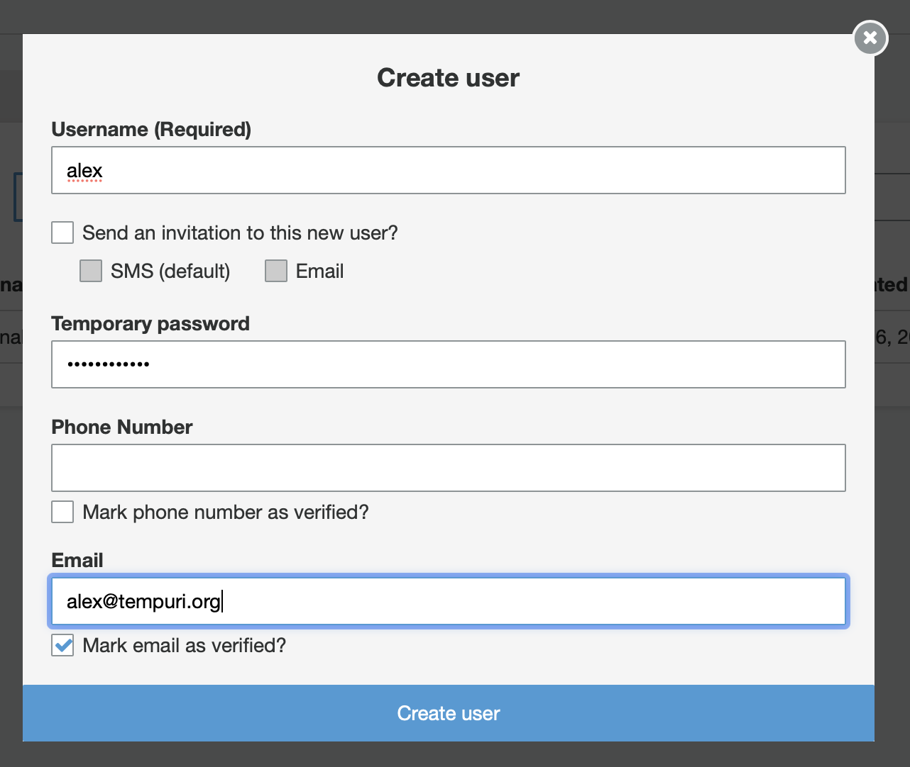
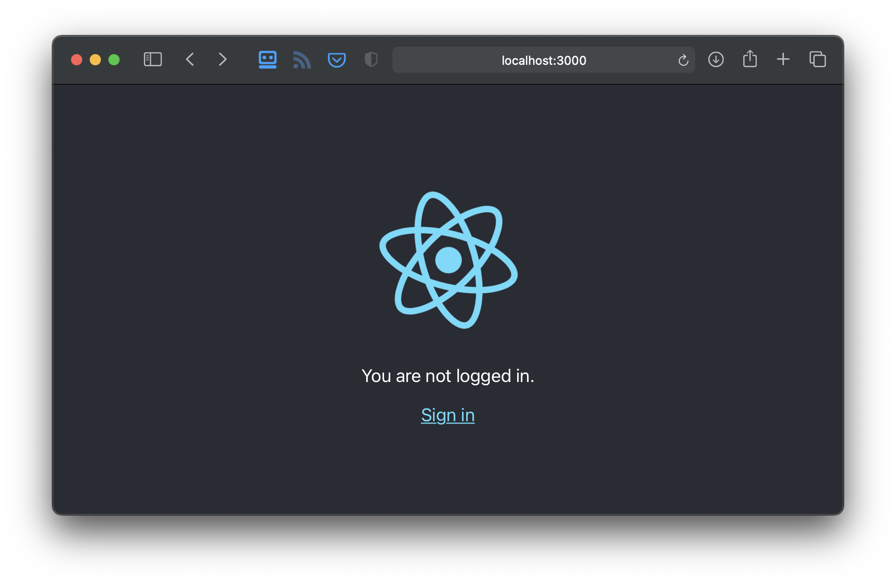
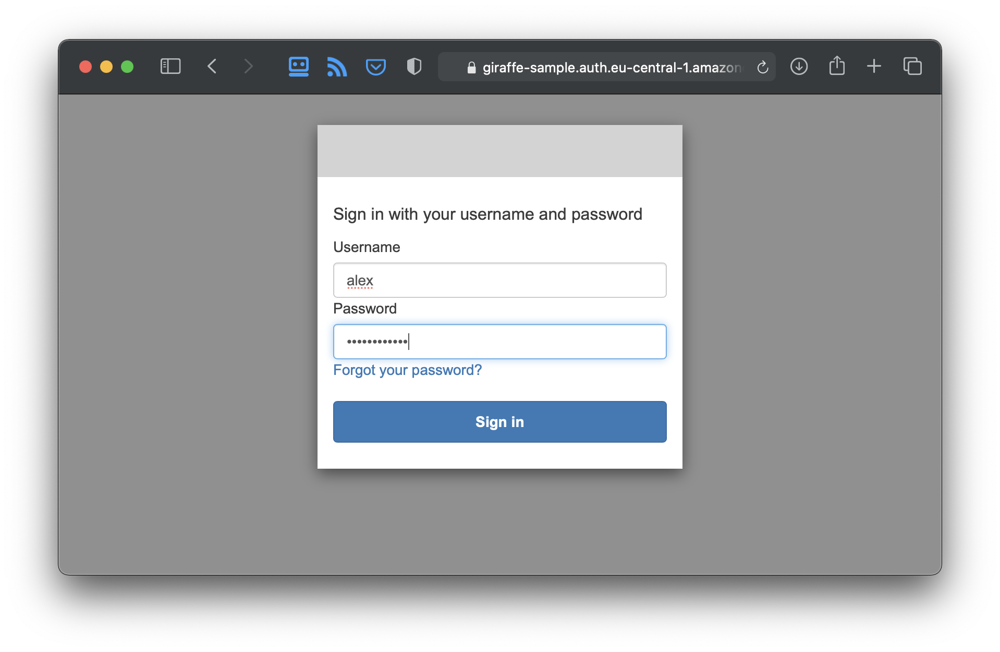
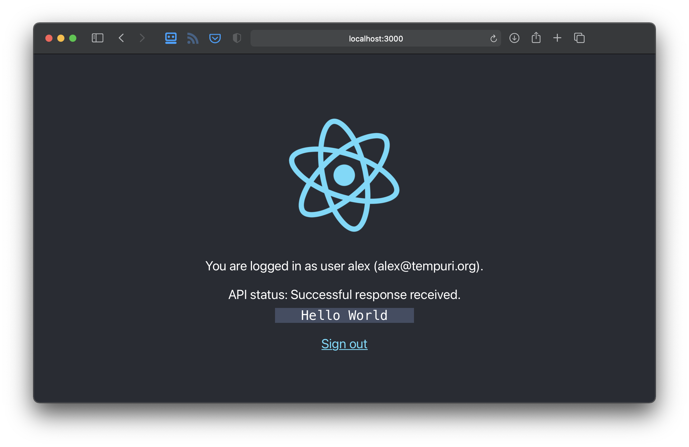

# AWS Cognito (via CDK) F# Giraffe React PKCE flow sample

This sample shows how to use [AWS Cognito]() (deployed via AWS CDK) together with an F# [Giraffe]() API and a React application with  Authorization Code Grant (PKCE). 

## Setup

Clone this repository.

### Cognito

#### Install / configure AWS CDK

```bash
npm install -g aws-cdk
```

* [Configure a user profile for CDK](https://docs.aws.amazon.com/cdk/latest/guide/getting_started.html)
* [Bootstrap AWS CDK](https://docs.aws.amazon.com/de_de/cdk/latest/guide/bootstrapping.html) (this may cause costs!)

#### Configure Cognito Userpool

Edit `src/cognito/lib/config.json`:

```json
{
  "userpoolName": "sample-user-pool",
  "scopeName": "api",
  "resourceServerName": "giraffe-server",
  "resourceServerIdentifier": "giraffe-server",
  "clientName": "react-client",
  "domainPrefix": "giraffe-sample"
}
```

#### Deploy Cognito

```bash
cd src/cognito
yarn
cdk deploy
```

Your output should look like this:

```bash
CognitoStack: deploying...

 ✅  CognitoStack

Outputs:
CognitoStack.domain = giraffe-sample
CognitoStack.reactClientId = 3ot29hu8k3cbikij2jat97sqou
CognitoStack.scopeName = giraffe-server/api
CognitoStack.userpoolId = eu-central-1_rypunXn4M
```

Make sure to grab the Information listed below "Outputs" - otherwise you'll have to lookup them in the AWS Cognito Console.

#### Create a Cognito User

- [Add a AWS Cognito User](https://docs.aws.amazon.com/cognito/latest/developerguide/how-to-create-user-accounts.html)

Sample:




### Giraffe API

#### Configure the Giraffe API

Change the settings in the `Config` module in `src/SampleAPI/Program.fs`:

```fsharp
module Config =
  let region = "eu-central-1" // your AWS region
  let userPoolId = "eu-central-1_rypunXn4M" // CognitoStack.userpoolId
  let clientId = "3ot29hu8k3cbikij2jat97sqou" // CognitoStack.reactClientId
  let scopeName = "giraffe-server/api" // CognitoStack.scopeName
  let clientUri = "http://localhost:3000"
```

#### Start the Giraffe API

```bash
dotnet run --no-restore
```

Your API should now be listening:

```bash
info: Microsoft.AspNetCore.DataProtection.KeyManagement.XmlKeyManager[62]
      User profile is available. Using '/Users/alexzeitler/.aspnet/DataProtection-Keys' as key repository; keys will not be encrypted at rest.
info: Microsoft.Hosting.Lifetime[0]
      Now listening on: http://localhost:5000
info: Microsoft.Hosting.Lifetime[0]
      Now listening on: https://localhost:5001
info: Microsoft.Hosting.Lifetime[0]
      Application started. Press Ctrl+C to shut down.
```

### React UI

#### Configure the React UI

Edit `src/ui/src/config/app-config.json`:

```json5
{
    "region": "eu-central-1", // your AWS region
    "userPool": "eu-central-1_rypunXn4M", // CognitoStack.userpoolId
    "userPoolBaseUri": "https://giraffe-sample.auth.eu-central-1.amazoncognito.com", // https://${CognitoStack.domain}.auth.${AWS_REGION}.amazoncognito.com
    "clientId": "3ot29hu8k3cbikij2jat97sqou", // CognitoStack.reactClientId
    "callbackUri": "http://localhost:3000/callback",
    "signoutUri": "http://localhost:3000",
    "tokenScopes": [
        "openid",
        "email",
        "profile",
        "giraffe-server/api" // CognitoStack.scopeName              
    ],
    "apiUri": "https://localhost:5001"
}
```

#### Start the React UI

```bash
cd src/ui
yarn start
```

Your browser should show this:



#### Login

Click the "Sign in" link in your UI:


Enter your credentials:




If everything went well, you'll see this screen:



## Credits

The UI is based on https://github.com/arronharden/cognito-demo-ui.